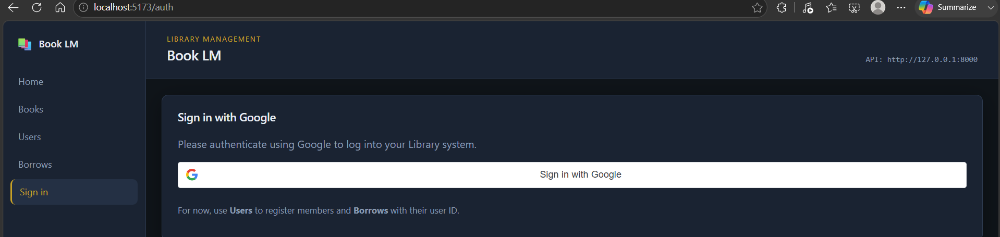
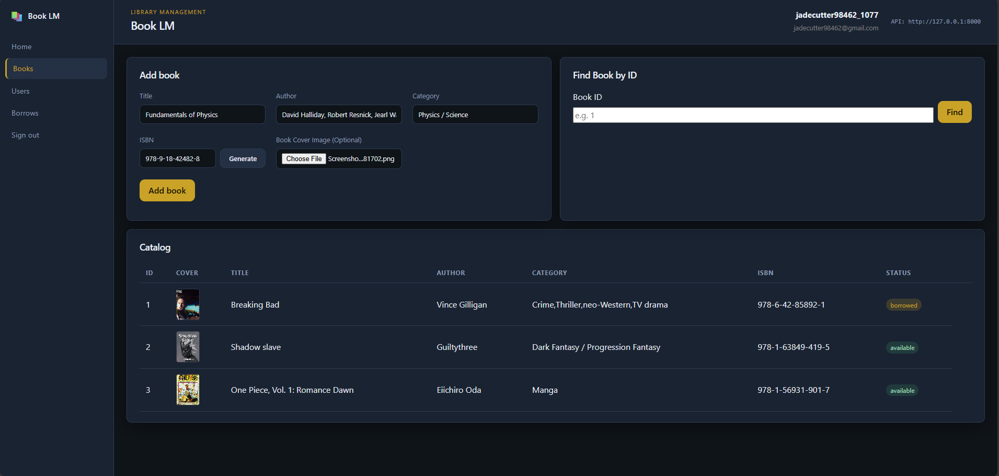
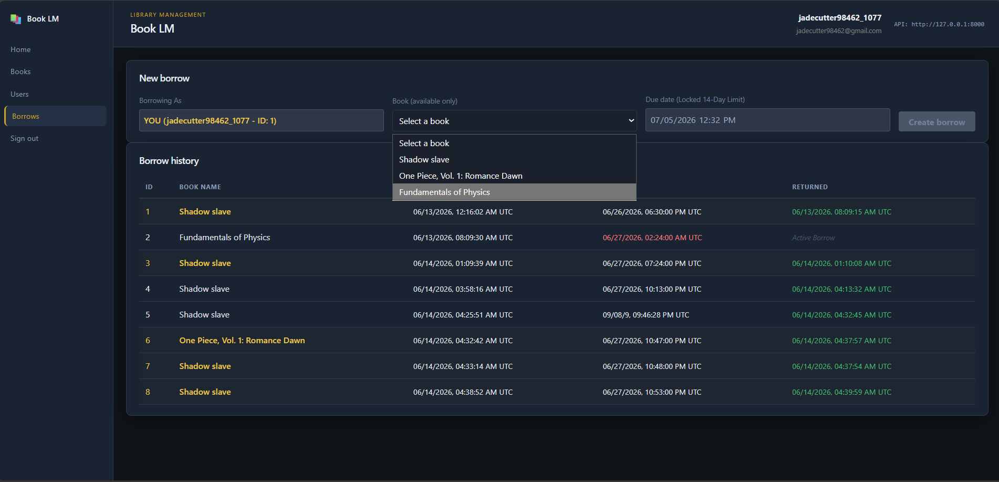

# Book LM - Library Management System

A professional, modern Library Management System built with a **FastAPI** asynchronous backend and a **React & TypeScript** frontend. The system supports full CRUD operations on books and users, record tracking for borrowed books, and Google OAuth 2.0 authentication combined with JSON Web Tokens (JWT).

---

## 📸 Screenshots

To showcase your project, replace the placeholders below with screenshots of your running application:

### 1. Google OAuth 2.0 Sign-In Option
*Provide a screenshot showing the clean landing page/auth page with the Google Sign-In button.*


### 2. Inventory / Create Book View
*Provide a screenshot showing the UI where users can add new books to the library inventory.*


### 3. Borrowing & Returning Books View
*Provide a screenshot showing how books can be checked out, their current status (borrowed/available), and the return actions.*


---

## 🛠️ Tech Stack & Key Concepts

### Backend
*   **Web Framework:** [FastAPI](https://fastapi.tiangolo.com/) (Asynchronous endpoints).
*   **Database ORM:** [SQLModel](https://sqlmodel.tiangolo.com/) (Combining SQLAlchemy & Pydantic).
*   **Database:** SQLite with asynchronous connections via `aiosqlite`.
*   **Security:** Google OAuth 2.0 (Token verification) & PyJWT (App-specific session tokens).
*   **Architecture:** Service-Repository layer pattern separating routers, business services, and database schemas.

### Frontend
*   **Build Tool & Framework:** Vite + React + TypeScript.
*   **Routing:** React Router DOM.
*   **Styling:** Modern, clean responsive design.

---

## 🚀 How to Run the Project

Follow these steps to set up and run both the backend and frontend locally.

### 1. Backend Setup

Open a terminal in the root directory:

```bash
# 1. Create a Python virtual environment (Optional but Recommended)
python -m venv venv

# 2. Activate the virtual environment
# On Windows (PowerShell):
.\venv\Scripts\Activate.ps1
# On Windows (CMD):
.\venv\Scripts\activate.bat
# On macOS/Linux:
source venv/bin/activate

# 3. Install required packages (including the async driver)
pip install -r requirements.txt aiosqlite

# 4. Start the FastAPI development server
uvicorn app.main:app --reload
```

The backend API will be available at `http://127.0.0.1:8000`. You can visit `http://127.0.0.1:8000/docs` to view the interactive Swagger API documentation.

### 2. Frontend Setup

Open a new terminal in the `frontend/` directory:

```bash
# 1. Navigate to the frontend folder
cd frontend

# 2. Install node dependencies
npm install

# 3. Start the Vite development server
npm run dev
```

The frontend application will be running at `http://localhost:5173`.

---

## 📁 Repository Structure

```text
Book LM/
├── app/
│   ├── auth/         # OAuth 2.0 & JWT utility functions, schemas, & dependencies
│   ├── books/        # Books routers, models, schemas, and services
│   ├── borrows/      # Borrow/Return transaction routers, models, & services
│   ├── users/        # User accounts schemas, routing, & database services
│   ├── database.py   # Async DB connection setup (AsyncSession)
│   ├── config.py     # Pydantic configuration settings
│   └── main.py       # FastAPI application initializations and lifespans
│
├── frontend/         # React + TypeScript Vite project source code
│
├── screenshots/      # Target folder for repository demo screenshots
├── .env              # Application secrets & DB URI configurations
└── requirements.txt  # Python dependency manifest
```

---

## 📄 Project Highlights (For Interviewers)

*   **Non-Blocking Async Database I/O:** Uses an asynchronous SQLite engine under the hood to ensure scaling capability under concurrent API calls.
*   **Third-Party Authentication flow:** Validates Google OAuth Identity tokens cryptographically on the backend before minting application-specific JWTs.
*   **Decoupled Architecture:** Strictly isolates HTTP controllers from database operations using the Service layer.
